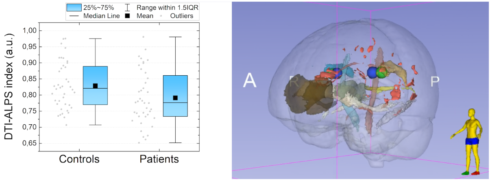
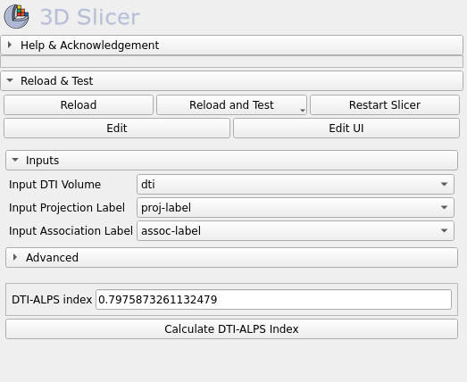

# Slicer Diffusion Tensor Image Analysis Along the Perivascular Space (DTI-ALPS)

{ width="250" .center}

Welcome to the Slicer Diffusion Tensor Image Analysis Along the Perivascular Space (DTI-ALPS)!

This 3D Slicer extension was designed to assist users in processing Diffusion Tensor Imaging (DTI) for the `DTI-ALPS` index calculation. 


The full documentation of the usage, implementation and updates in the `DTI-ALPS` index is given in this repository and posted online using a [web-based host](https://slicer-dti-alps.readthedocs.io/en/latest/). 

## Output examples

The `Slicer DTI-ALPS` extension is a simple way to collect the `DTI-ALPS` index using a GUI interface. The images below represents some examples:

{ width="600" .center}

DTI-ALPS index application in evaluating Neuromyelitis optica (NMO) patients

{ width="600" .center}

DTI-ALPS index GUI that simplify the image parameters and methods calculation

## Modules

### DTI-ALPS

This module is able to calculate the `DTI-ALPS` index from a standard Diffusion-Tensor (DTI) MRI image. In this case, it is needed to use the tensorial image that was already reconstructed by other toolkit. For instance, the 3D Slicer `DMRI Diffusion` extension can assist you to collect the DTI image for this step.


## How to use this tool

The `DTI-ALPS` calculation can be executed, at the moment, by two forms:

1. Using the GUI interface
2. Using the `runDTIALPS.py` command-line interface (CLI)

### Using the GUI interface

For the GUI option, it only requires a DTI image (using the tensorial orientation space) and two ROIs defining the Projection and Association fibers location.

!!! note inline end "Using the MNI space orientation"

    If you does not have a set of Projection and Association ROIs, it can be used a standard ROIs by selecting the `Advanced` checkbox called `Input is in MNI space (2 mm resolution)`. By using this set the `DTI-ALPS` module will load at runtime a set of ROIs adopting the MNI 2mm brain template. However, the input DTI image must be at the same MNI space.

!!! tip inline end "DTI resample to MNI"

    A handy way to resample the input DTI image to MNI space can be done by using the 3D Slicer `DMRI Diffusion` extension that provide a normalization and resample method to use in DTI data. See more details at the [3D Slicer DMRI documentation](https://dmri.slicer.org/).

### Using the CLI script

If you want to execute the `DTI-ALPS` rapdly, it can be done by the Python script called: `runDTIALPS.py` that is installed with the `Slicer DTI-ALPS` extension. 

!!! info inline end "Before execution the runDTIALPS script"

    Before executing the script, make sure where is the path location that was used in the Slicer DTI-ALPS extension installation. The `runDTIALPS.py` script is placed inside the extension folder.

Assuming that Slicer is installed on Linux/Mac machines:

```bash
./Slicer --no-main-window --no-splash --python-script /path/to/module/runDTIALPS.py dti_volume.nrrd proj-label.nrrd assoc-label.nrrd
```

Assuming that Slicer is installed on Windows machines:

```bash
Slicer.exe --no-main-window --no-splash --python-script /path/to/module/runDTIALPS.py dti_volume.nrrd proj-label.nrrd assoc-label.nrrd
```

It is also able to execute the `runDTIALPS.py` with some options:

1. `--MNISpace`: Informs whether the input DTI image is already in the MNI space (2 mm resolution). If yes, the input Proj/Assoc paths are changed for the standard MNI labels instead.

2. `--verbose`: Show more details thoughout the processing.

!!! note inline end "When to use --MNISpace option"

    When the `--MNISpace` is used, there is no need to provide the Proj/Assoc labels because the standard MNI labels are applied instead


To see more details about the options given at the `runDTIALPS.py` script, one may call the help details by running:

Linux/Mac:

```bash
./Slicer --no-main-window --no-splash --python-script /path/to/module/runDTIALPS.py -h
```

Windows:

```bash
Slicer.exe --no-main-window --no-splash --python-script /path/to/module/runDTIALPS.py -h
```

## Cite this tool

We hope that the `DTI-ALPS` can be helpful for your applications. If possible, recall to cite at least one of the following publications:

* Senra Filho, A. C. da S.; Paschoal, A. M. "DTI-ALPS index as complementary information for Neuromyelitis Optica patients: a preliminary evaluation". ISMR & ISMRT Annual Meeting (2025)

## License

This project is under MIT license and following details are given at the [LICENSE](https://github.com/LOAMRI/Slicer-DTI-ALPS/blob/main/LICENSE) file in the project repository.